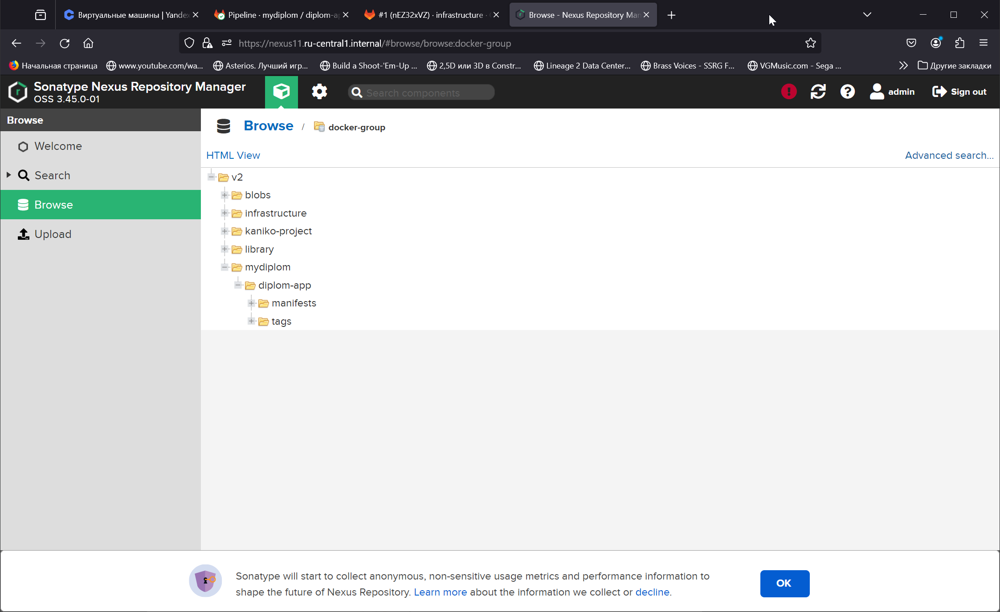

# Дипломный практикум в Yandex.Cloud

<details><summary>Задание дипломной работы</summary>
 
  * [Цели:](#цели)
  * [Этапы выполнения:](#этапы-выполнения)
     * [Создание облачной инфраструктуры](#создание-облачной-инфраструктуры)
     * [Создание Kubernetes кластера](#создание-kubernetes-кластера)
     * [Создание тестового приложения](#создание-тестового-приложения)
     * [Подготовка cистемы мониторинга и деплой приложения](#подготовка-cистемы-мониторинга-и-деплой-приложения)
     * [Установка и настройка CI/CD](#установка-и-настройка-cicd)
  * [Что необходимо для сдачи задания?](#что-необходимо-для-сдачи-задания)
  * [Как правильно задавать вопросы дипломному руководителю?](#как-правильно-задавать-вопросы-дипломному-руководителю)

**Перед началом работы над дипломным заданием изучите [Инструкция по экономии облачных ресурсов](https://github.com/netology-code/devops-materials/blob/master/cloudwork.MD).**

---
## Цели:

1. Подготовить облачную инфраструктуру на базе облачного провайдера Яндекс.Облако.
2. Запустить и сконфигурировать Kubernetes кластер.
3. Установить и настроить систему мониторинга.
4. Настроить и автоматизировать сборку тестового приложения с использованием Docker-контейнеров.
5. Настроить CI для автоматической сборки и тестирования.
6. Настроить CD для автоматического развёртывания приложения.

---
## Этапы выполнения:


### Создание облачной инфраструктуры

Для начала необходимо подготовить облачную инфраструктуру в ЯО при помощи [Terraform](https://www.terraform.io/).

Особенности выполнения:

- Бюджет купона ограничен, что следует иметь в виду при проектировании инфраструктуры и использовании ресурсов;
Для облачного k8s используйте региональный мастер(неотказоустойчивый). Для self-hosted k8s минимизируйте ресурсы ВМ и долю ЦПУ. В обоих вариантах используйте прерываемые ВМ для worker nodes.
- Следует использовать версию [Terraform](https://www.terraform.io/) не старше 1.5.x .

Предварительная подготовка к установке и запуску Kubernetes кластера.

1. Создайте сервисный аккаунт, который будет в дальнейшем использоваться Terraform для работы с инфраструктурой с необходимыми и достаточными правами. Не стоит использовать права суперпользователя
2. Подготовьте [backend](https://www.terraform.io/docs/language/settings/backends/index.html) для Terraform:  
   а. Рекомендуемый вариант: S3 bucket в созданном ЯО аккаунте(создание бакета через TF)
   б. Альтернативный вариант:  [Terraform Cloud](https://app.terraform.io/)  
3. Создайте VPC с подсетями в разных зонах доступности.
4. Убедитесь, что теперь вы можете выполнить команды `terraform destroy` и `terraform apply` без дополнительных ручных действий.
5. В случае использования [Terraform Cloud](https://app.terraform.io/) в качестве [backend](https://www.terraform.io/docs/language/settings/backends/index.html) убедитесь, что применение изменений успешно проходит, используя web-интерфейс Terraform cloud.

Ожидаемые результаты:

1. Terraform сконфигурирован и создание инфраструктуры посредством Terraform возможно без дополнительных ручных действий.
2. Полученная конфигурация инфраструктуры является предварительной, поэтому в ходе дальнейшего выполнения задания возможны изменения.

---
### Создание Kubernetes кластера

На этом этапе необходимо создать [Kubernetes](https://kubernetes.io/ru/docs/concepts/overview/what-is-kubernetes/) кластер на базе предварительно созданной инфраструктуры.   Требуется обеспечить доступ к ресурсам из Интернета.

Это можно сделать двумя способами:

1. Рекомендуемый вариант: самостоятельная установка Kubernetes кластера.  
   а. При помощи Terraform подготовить как минимум 3 виртуальных машины Compute Cloud для создания Kubernetes-кластера. Тип виртуальной машины следует выбрать самостоятельно с учётом требовании к производительности и стоимости. Если в дальнейшем поймете, что необходимо сменить тип инстанса, используйте Terraform для внесения изменений.  
   б. Подготовить [ansible](https://www.ansible.com/) конфигурации, можно воспользоваться, например [Kubespray](https://kubernetes.io/docs/setup/production-environment/tools/kubespray/)  
   в. Задеплоить Kubernetes на подготовленные ранее инстансы, в случае нехватки каких-либо ресурсов вы всегда можете создать их при помощи Terraform.
2. Альтернативный вариант: воспользуйтесь сервисом [Yandex Managed Service for Kubernetes](https://cloud.yandex.ru/services/managed-kubernetes)  
  а. С помощью terraform resource для [kubernetes](https://registry.terraform.io/providers/yandex-cloud/yandex/latest/docs/resources/kubernetes_cluster) создать **региональный** мастер kubernetes с размещением нод в разных 3 подсетях      
  б. С помощью terraform resource для [kubernetes node group](https://registry.terraform.io/providers/yandex-cloud/yandex/latest/docs/resources/kubernetes_node_group)
  
Ожидаемый результат:

1. Работоспособный Kubernetes кластер.
2. В файле `~/.kube/config` находятся данные для доступа к кластеру.
3. Команда `kubectl get pods --all-namespaces` отрабатывает без ошибок.

---
### Создание тестового приложения

Для перехода к следующему этапу необходимо подготовить тестовое приложение, эмулирующее основное приложение разрабатываемое вашей компанией.

Способ подготовки:

1. Рекомендуемый вариант:  
   а. Создайте отдельный git репозиторий с простым nginx конфигом, который будет отдавать статические данные.  
   б. Подготовьте Dockerfile для создания образа приложения.  
2. Альтернативный вариант:  
   а. Используйте любой другой код, главное, чтобы был самостоятельно создан Dockerfile.

Ожидаемый результат:

1. Git репозиторий с тестовым приложением и Dockerfile.
2. Регистри с собранным docker image. В качестве регистри может быть DockerHub или [Yandex Container Registry](https://cloud.yandex.ru/services/container-registry), созданный также с помощью terraform.

---
### Подготовка cистемы мониторинга и деплой приложения

Уже должны быть готовы конфигурации для автоматического создания облачной инфраструктуры и поднятия Kubernetes кластера.  
Теперь необходимо подготовить конфигурационные файлы для настройки нашего Kubernetes кластера.

Цель:
1. Задеплоить в кластер [prometheus](https://prometheus.io/), [grafana](https://grafana.com/), [alertmanager](https://github.com/prometheus/alertmanager), [экспортер](https://github.com/prometheus/node_exporter) основных метрик Kubernetes.
2. Задеплоить тестовое приложение, например, [nginx](https://www.nginx.com/) сервер отдающий статическую страницу.

Способ выполнения:
1. Воспользовать пакетом [kube-prometheus](https://github.com/prometheus-operator/kube-prometheus), который уже включает в себя [Kubernetes оператор](https://operatorhub.io/) для [grafana](https://grafana.com/), [prometheus](https://prometheus.io/), [alertmanager](https://github.com/prometheus/alertmanager) и [node_exporter](https://github.com/prometheus/node_exporter). При желании можете собрать все эти приложения отдельно.
2. Для организации конфигурации использовать [qbec](https://qbec.io/), основанный на [jsonnet](https://jsonnet.org/). Обратите внимание на имеющиеся функции для интеграции helm конфигов и [helm charts](https://helm.sh/)
3. Если на первом этапе вы не воспользовались [Terraform Cloud](https://app.terraform.io/), то задеплойте и настройте в кластере [atlantis](https://www.runatlantis.io/) для отслеживания изменений инфраструктуры. Альтернативный вариант 3 задания: вместо Terraform Cloud или atlantis настройте на автоматический запуск и применение конфигурации terraform из вашего git-репозитория в выбранной вами CI-CD системе при любом комите в main ветку. Предоставьте скриншоты работы пайплайна из CI/CD системы.

Ожидаемый результат:
1. Git репозиторий с конфигурационными файлами для настройки Kubernetes.
2. Http доступ к web интерфейсу grafana.
3. Дашборды в grafana отображающие состояние Kubernetes кластера.
4. Http доступ к тестовому приложению.

---
### Установка и настройка CI/CD

Осталось настроить ci/cd систему для автоматической сборки docker image и деплоя приложения при изменении кода.

Цель:

1. Автоматическая сборка docker образа при коммите в репозиторий с тестовым приложением.
2. Автоматический деплой нового docker образа.

Можно использовать [teamcity](https://www.jetbrains.com/ru-ru/teamcity/), [jenkins](https://www.jenkins.io/), [GitLab CI](https://about.gitlab.com/stages-devops-lifecycle/continuous-integration/) или GitHub Actions.

Ожидаемый результат:

1. Интерфейс ci/cd сервиса доступен по http.
2. При любом коммите в репозиторие с тестовым приложением происходит сборка и отправка в регистр Docker образа.
3. При создании тега (например, v1.0.0) происходит сборка и отправка с соответствующим label в регистри, а также деплой соответствующего Docker образа в кластер Kubernetes.

---
## Что необходимо для сдачи задания?

1. Репозиторий с конфигурационными файлами Terraform и готовность продемонстрировать создание всех ресурсов с нуля.
2. Пример pull request с комментариями созданными atlantis'ом или снимки экрана из Terraform Cloud или вашего CI-CD-terraform pipeline.
3. Репозиторий с конфигурацией ansible, если был выбран способ создания Kubernetes кластера при помощи ansible.
4. Репозиторий с Dockerfile тестового приложения и ссылка на собранный docker image.
5. Репозиторий с конфигурацией Kubernetes кластера.
6. Ссылка на тестовое приложение и веб интерфейс Grafana с данными доступа.
7. Все репозитории рекомендуется хранить на одном ресурсе (github, gitlab)
</details>

## Общие сведения по решению
В автоматическом режиме (с минимум ручных действий) производятся развертывание и управление инфраструктурой, сборка тестового приложения и его развертывание в кластере Kubernetes.

### Инфраструктура
#### Окружения
Для реализации проекта используются три воркспейса или окружения - `stage`, `dev`, `prod`.
- `stage` - окружение для подготовки и деплоймента последующих окружений; 
- `dev` - окружение, в котором разворачивается кластер тестирования и сборки приложения;
- `prod` - окружение, в котором разворачивается кластер деплоймента приложения. 

В окружении `stage` разворачиваются `gitlab` и `gitlab-runner`, `nexus`, `bastion` на отдельных ВМ. `gitlab` используется в качестве хранилища исходного кода, хранилища конфигураций, оркестратора CI/CD-процессов. `nexus` выступает в качестве хранилища бинарных файлов. Для развертывания и управления инфраструктурой используются `terraform`, `ansible`, `docker` и `helm`. Запуск пайплайна по установке кластеров, сборке необходимых контейнеров производится с помощью `gitlab-runner`. `bastion` используется для удаленного доступа к управлению сервисами в Yandex Cloud.
Конфигурация окружений хранится в каталоге [infrastructure/envs](infrastructure/envs/).

#### Сеть
С помощью `terraform` разворачивается сеть `infra-net`, использующая таблицы маршрутизации и разделяющаяся на пять подсетей в соответствии с созданными окружениями:
- `stage` - подсеть для инстансов окружения `stage`;
- `dev-a`, `dev-b` - подсеть в 2х разных зонах доступности для окружения `dev`;
- `prod-a`, `prod-b` - подсеть в 2х разных зонах доступности для окружения `prod`.

Доступ в сеть окружения `stage` осуществляется через `bastion`. Доступ в интернет организован через `NAT-gateway`. Доступ к приложению осуществляется через yandex-managed Application Load Balancer.

#### DNS
В проекте используется внутренняя зона YC `ru-central1.internal.` для регистрации в ней сервисов `gitlab` и `nexus` для последующего доступа по DNS-имени. Для доступа к административной панели `gitlab` и `nexus` в DNS-зоне используется самоподписные сертификаты.

### Starter image

Для развертывания инфраструктуры, окружений, кластеров в окружениях, а также для деплоя приложения в кластер используется образ [starter](starter/Dockerfile), содержащий необходимые системы и утилиты (`ansible`,`helm`, `kubectl`, `terraform`, `yc`), перечень необходимых манифестов для разворачивания окружений:

- [модули terraform](starter/terraform) для установки окружений
- [ansible playbooks](starter/ansible) для установки настройки систем и сервисов в окружения
- [helm-чарт](starter/helm/) для описания деплоймента тестового приложения в кластер
- [скрипты](starter/scripts) для упрощения запуска операций развертывания окружений, сервисов и тестового приложения

## Установка
На машине, с которой будет производиться установка проекта, должны быть установлены `docker`, `yc`, `jq` и `git`.

### Подготовка
1. Предварительно необходимо создать некоторые объекты YC (мне показалось быстрее использовать консольные команды `yc` чем готовитиь отдельный terraform-манифест):

создаем сеть
```console
dimi@DESKTOP-K8RTBSS:~$ yc vpc network create infra-net
id: enplh7nsh0j5ss965pqg
folder_id: b1gegnnp4nj6ob9hcb8q
created_at: "2024-03-02T17:49:01Z"
name: infra-net
default_security_group_id: enpmlq0nt2os8cebepvk
```
создаем Nat-gateway
```console
dimi@DESKTOP-K8RTBSS:~$ yc vpc gateway create \
--nam>    --name net-gateway
id: enpkq1vfqdbsop080jmb
folder_id: b1gegnnp4nj6ob9hcb8q
created_at: "2024-03-02T17:28:58Z"
name: net-gateway
shared_egress_gateway: {}
```
создаем таблицу маршрутизации
```console
dimi@DESKTOP-K8RTBSS:~$ yc vpc route-table create routing \
>   --route destination=0.0.0.0/0,gateway-id=enpkq1vfqdbsop080jmb \
>   --network-name infra-net \
>   --folder-name default
id: enplupa23v13snfkthtq
folder_id: b1gegnnp4nj6ob9hcb8q
created_at: "2024-03-09T19:32:24Z"
name: routing
network_id: enplh7nsh0j5ss965pqg
static_routes:
  - destination_prefix: 0.0.0.0/0
    gateway_id: enpkq1vfqdbsop080jmb
```
создаем хранилище состояния окружений
```console
dimi@DESKTOP-K8RTBSS:~$ yc storage bucket create \
>    --name mydiplom \
>    --default-storage-class standard \
>    --max-size 0 \
>    --public-read \
>    --public-list \
>    --public-config-read
name: mydiplom
folder_id: b1gegnnp4nj6ob9hcb8q
anonymous_access_flags:
  read: false
  list: false
default_storage_class: STANDARD
versioning: VERSIONING_DISABLED
acl: {}
created_at: "2024-03-02T17:38:13.953915Z"
```
создаем сервисный аккаунт в случае отсутствия
```console
dimi@DESKTOP-K8RTBSS:~$ yc iam access-key create --service-account-name admin
dimi@DESKTOP-K8RTBSS:~$ yc iam service-account list
+----------------------+-------+
|          ID          | NAME  |
+----------------------+-------+
| aje0osjh845vcdp2tr6e | admin |
+----------------------+-------+
```

Также требуется сгенерировать необходимые сертификаты:

самоподписные сертификаты
```console
dimi@DESKTOP-K8RTBSS:~$ openssl genrsa -out rootCA.key 4096
dimi@DESKTOP-K8RTBSS:~$ openssl req -x509 -new -nodes -key rootCA.key -sha256 -days 365 -out rootCA.crt
dimi@DESKTOP-K8RTBSS:~$ openssl genrsa -out ru-central1.internal.key 2048
dimi@DESKTOP-K8RTBSS:~$ openssl req -new -sha256 \
>     -key ru-central1.internal.key \
>     -subj "/CN=ru-central1.internal" \
>     -reqexts SAN \
>     -config <(cat /etc/ssl/openssl.cnf \
>         <(printf "\n[SAN]\nsubjectAltName=DNS:*.ru-central1.internal")) \
>     -out ru-central1.internal.csr
dimi@DESKTOP-K8RTBSS:~$ openssl x509 -req \
file <(> -extfile <(printf "subjectAltName=DNS:*.ru-central1.internal") \
> -days 720 \
> -in ru-central1.internal.csr \
> -CA rootCA.crt \
> -CAkey rootCA.key \
> -CAcreateserial \
> -out ru-central1.internal.crt
Certificate request self-signature ok
subject=CN = ru-central1.internal
```
ключ для доступа к нодам
```console
dimi@DESKTOP-K8RTBSS:~$ ssh-keygen -t rsa -f $HOME/yc_key
```
2. Заносим полученные сведения в ansible-secret файл для `stage` окружения `./infrastructure/envs/env-platform/group_vars/all/secrets.yaml` по [шаблону](infrastructure/envs/env-stage/group_vars/all/tpl.secrets.yaml) и шифруем его.
3. Также вносим сведения о корневом сертификате в [dev](infrastructure/envs/env-dev/group_vars/all/tpl.secrets.yml) и [prod](infrastructure/envs/env-prod/group_vars/all/tpl.secrets.yml) окружения и шифруем их.
4. Вносим необходимые сведения в файл [starter.env.template](starter/tpl.starter.env) и сохраняем как starter.env

### Сборка и запуск Starter-образа
1. Собираем образ с помощью команды:
```console
docker build --no-cache ./starter/ -t starter
```
2. Запускаем собранный `starter` контейнер:
```console
docker run \
        --rm \
        --env-file starter/starter.env \
        -v $(pwd)/infrastructure:/app/infrastructure \
        -v $HOME/yc_key.pub:/root/yc_key.pub \
        -v $HOME/yc_key:/root/yc_key \
        -v $(pwd)/mydiplom/components:/mydiplom \
        -ti builder
```
### Деплой окружения `stage`
1. В запущенном контейнере выполняем команду `terraform_plan`, для вывода списка ресурсов, которые будут созданы, после чего выполняем команду `terraform_apply`. В результате должны появиться виртуальные машины `gitlab`, `nexus`, `bastion` и сетевое окружение.
2. Настраиваем `bastion` командой `provision_bastion`. Эта команда установит все необходимые пакеты и сменит SSH-порт на 22322.
3. Добавляем переменную `ANSIBLE_SSH_COMMON_ARGS`, чтобы ansible работал через настроенный `bastion`:
```console
export ANSIBLE_SSH_COMMON_ARGS='-o StrictHostKeyChecking=no -o ProxyCommand="ssh -W %h:%p -q ubuntu@'BASTION_IP' -p 22322"'
```
4. Запускаем команду `provision_misc` для обновления пакетов на всех установленных хостах и добавления доверенных сертификатов.
5. Запускаем команду `provision_nexus` для установки и настройки Nexus CE.
6. Запускаем `provision_gitlab` для установки Gitlab CE.
7. Для доступа внутрь развернутого окружения к веб-интерфейсам `gitlab` и `nexus` нужно использовать `bastion` в качестве SOCKS5-proxy, поэтому на рабочей машине запускаем команду:
```console
ssh -D 1337 -f -C -q -N ubuntu@BASTION_IP -p 22322
```
8. В браузере прописываем SOCKS5-прокси localhost:1337, после чего можно подключаться к `gitlab` и `nexus`:
- https://gitlab11.ru-central1.internal/
- https://nexus11.ru-central1.internal/

### Установка и настройка репозиториев
1. Запускаем команду `provision_infra_repo`. Эта команда скопирует текущий репозиторий в `gitlab`, а также создаст репозиторий с конфигурацией остальных окружений.
2. Запускаем команду `provision_infra_runner`. Эта команда создаст раннер и подключит его к `giltab`.
3. Запускаем команду `provision_apps_repo`. Эта команда создаст репозиторий, содержащий исходный код тестового приложения, а также репозиторий деплоя в `prod` кластер.


4. Заходим в репозиторий `infrasctructure/devops-diplom` и сделаем любой коммит в каталоге `./starter`. Это запустит пайплайн, который соберет `starter`-образ и запушит его в `nexus`.


### Установка dev и prod окружений
1. Открываем настройки раннера для `mydiplom`, копируем токен, открываем переменные CI/CD в репозитории `infrastructure/envs` и устанавливаем переменную `RUNNER_TOKEN` для окружения `dev`.
2. Открываем репозиторий `infrastructure/envs` и создаем ветку `env-dev`.
3. Делаем коммит в `master`-ветку, создаем merge request в ветку `env-dev`. При создании `MR` выполнится pipeline, который показывает список ресурсов (terraform plan) для деплоя окружения `dev`.
4. Делаем merge, он запустит пайплайн, который
    - выполнит `terraform apply`,
    - произведет первоначальную настройку инстансов (обновит пакеты и добавит доверенные сертификаты),
    - установит кластер с помощью `kubespray`,
    - задеплоит в кластер runner и мониторинг с помощью `helm`.

5. Повторить вышеуказанные шаги для установки `prod` окружения. `RUNNER_TOKEN` для `prod` кластера нужно брать из проекта `release/release-prod`.


Перечень используемых ресурсов YC примерно должен выглядеть так


Для проверки работоспособности кластеров в созданных окружениях необходимо из job `provision.k8s` в пайплайне скачать артефакт, содержащий `kubeconfig`. Отредактировать `kubeconfig`, добавив:
```console
proxy-url: socks5://localhost:1337
```

### Сборка тестового приложения
Тестовое приложение из репозитория `https://github.com/Dimi-link/diplom-app` копируется в репозиторий `mydiplom/diplom-app` `gitlab` на этапе деплоя окружения `stage`.
1. Открываем данный репозиторий в группе `mydiplom`
2. Переходим в перечень тэгов
3. Находим последний созданный в репозитории тэг и создаем новый тэг на тот же коммит. Это изменение должно запустить пайплайн, выполняющий сборку и публикующий образ в `nexus`.



### Деплой тестового приложения
На этом этапе будет произведен деплой тестового приложения в `prod` кластер.
1. Открываем репозиторий `release/release-prod`
2. Создаем коммит и пушим в `master`, что запустит пайплайн установки приложения в кластер.
3. Проверяем запуск всех подов в окружении `prod`


4. Проверяем работоспособность тестового приложения по адресу балансировщика и порту, указанному в манифесте инфраструктуры

